# Hosting a Static Website Using AWS Amplify and S3
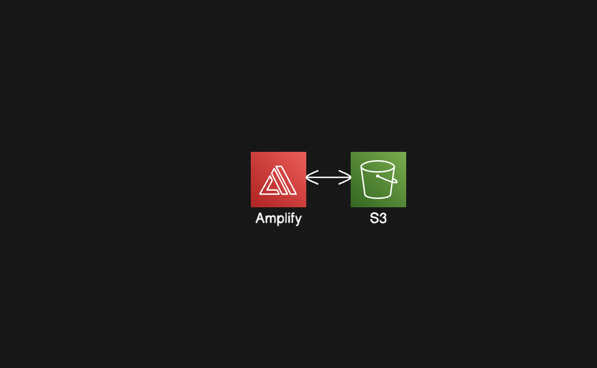
### Step 1: Create an S3 Bucket
1. Go to the **S3 Console** and click on the **Create Bucket** button.
   
    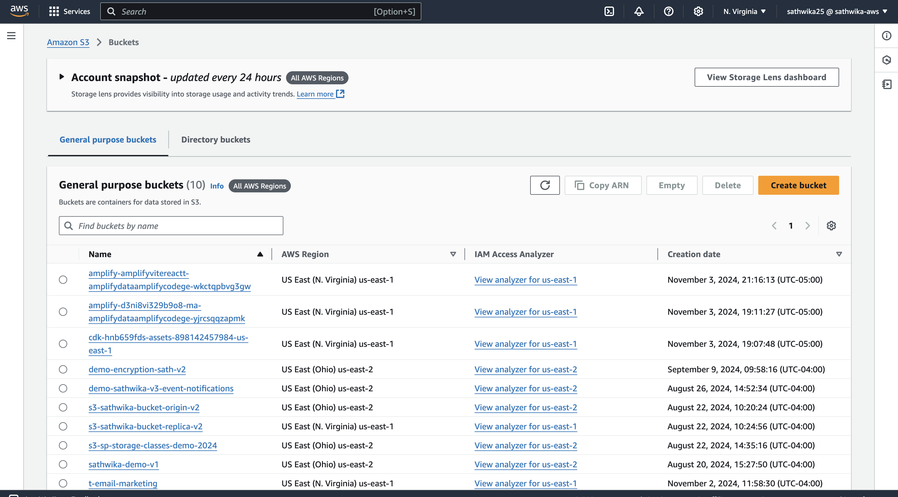
   
2. Enter a unique name for your bucket (e.g., `mystaticwebsite-11162025`).
   
     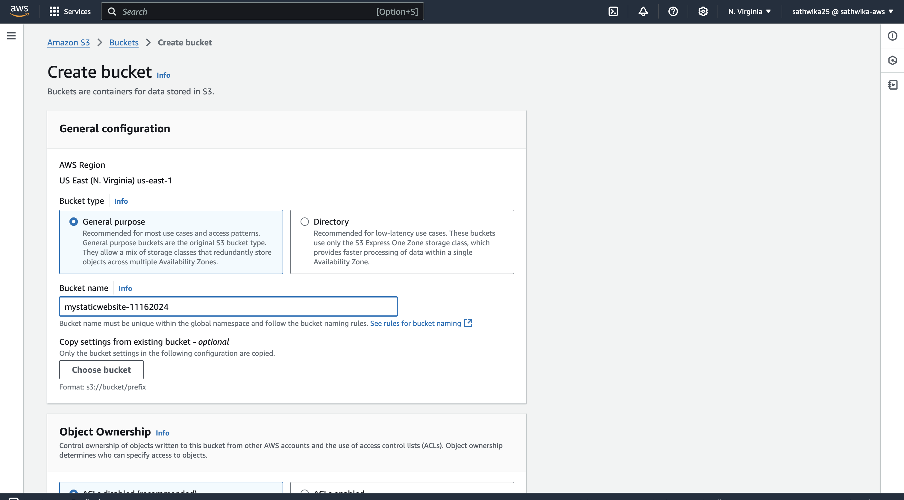
   
3. Leave all other options as default, scroll down, and click **Create Bucket**.   
   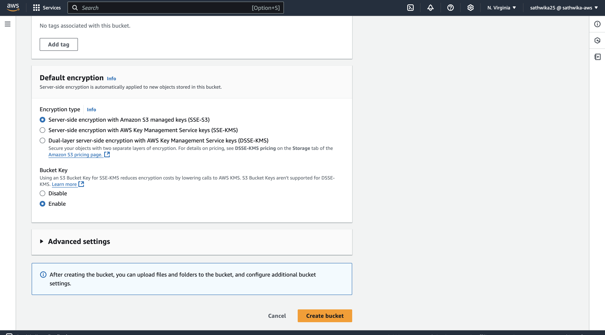

### Step 2: Upload Your Files
1. Open the newly created bucket.
 
   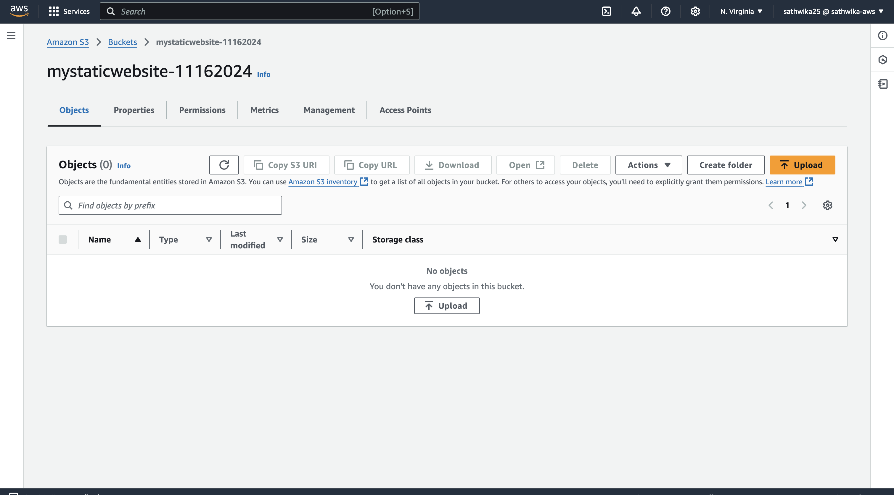
   
2. Click **Upload** and add the `index.html` file and `happy_learning.jpg` file. Now the objects are in your S3 bucket.
   
   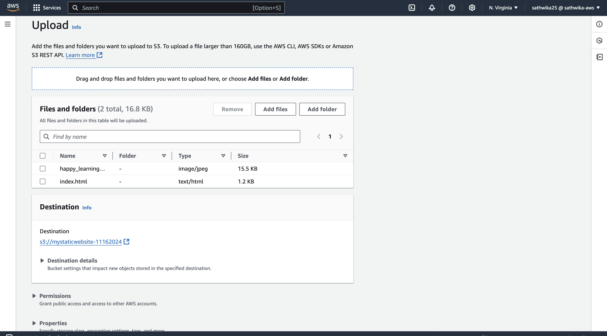

### Step 3: Enable Static Website Hosting with Amplify
1. Go to the **Properties** tab of your bucket.
   
   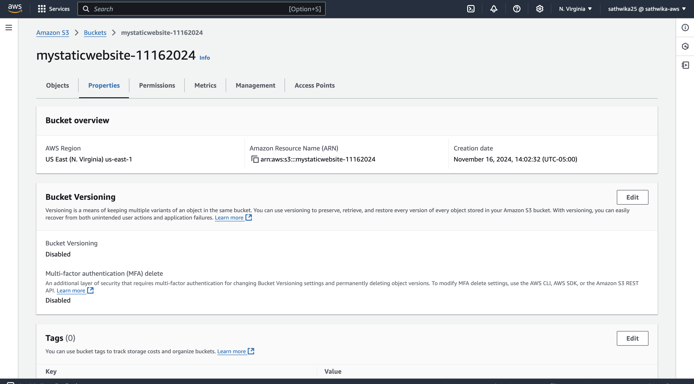
   
2. Scroll to the bottom and locate **Static Website Hosting**.
   
   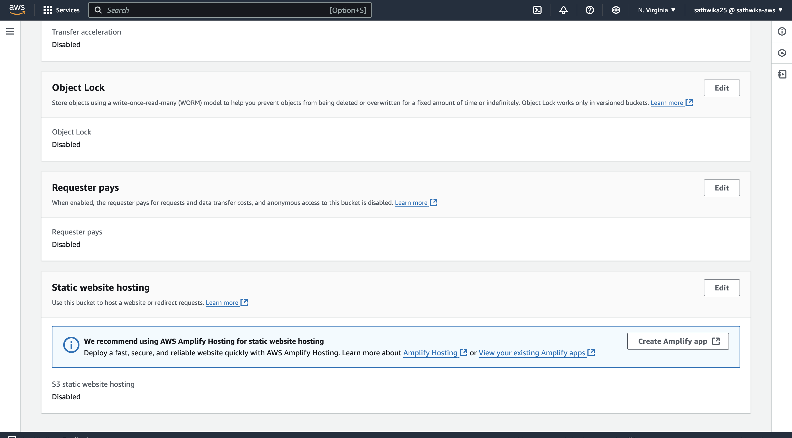

3. Click **Create Amplify App**, leave the options as default, and click **Save and Deploy**.
   
   

### Step 4: Access Your Website
1. Once the deployment is complete, go to the **Amplify Console**.
   
   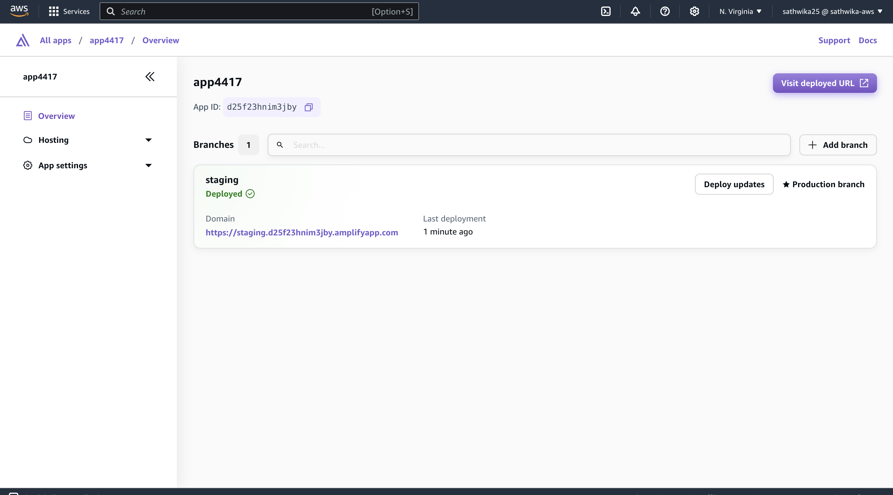
   
2. Locate the URL in the **Domain** section (e.g., `https://staging.d25f23hnim3jby.amplifyapp.com/`) and visit your website.
   
   

### Step 5: Update Your Website
1. To make changes, update your `index.html` or other files, and re-upload them to the S3 bucket.
   
2. In the **Amplify Console**, click **Deploy Updates**, select **Amazon S3**, and then click **Save and Deploy**.
   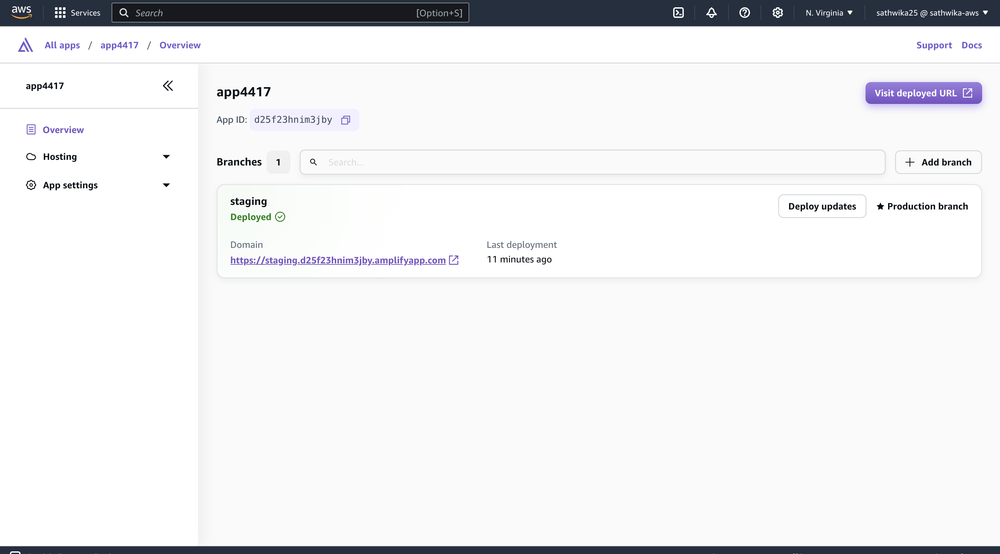
   
   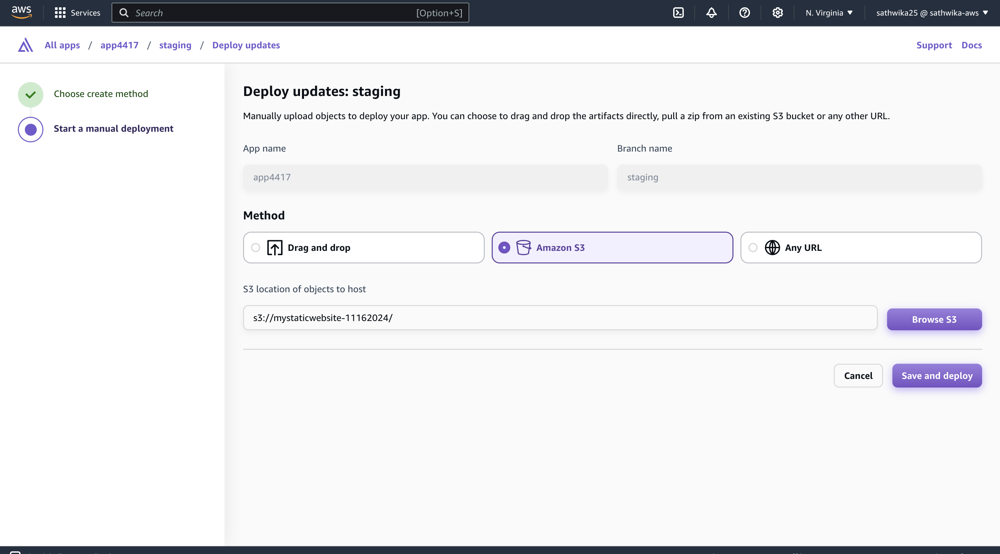

---

### Additional Information
The key advantage of hosting a static website with **S3 and Amplify** instead of standalone S3 is the ability to use custom domain names and leverage Amplify’s integration and management features.
